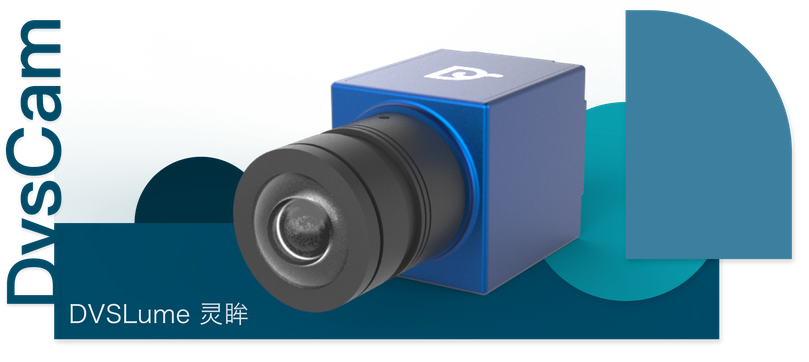
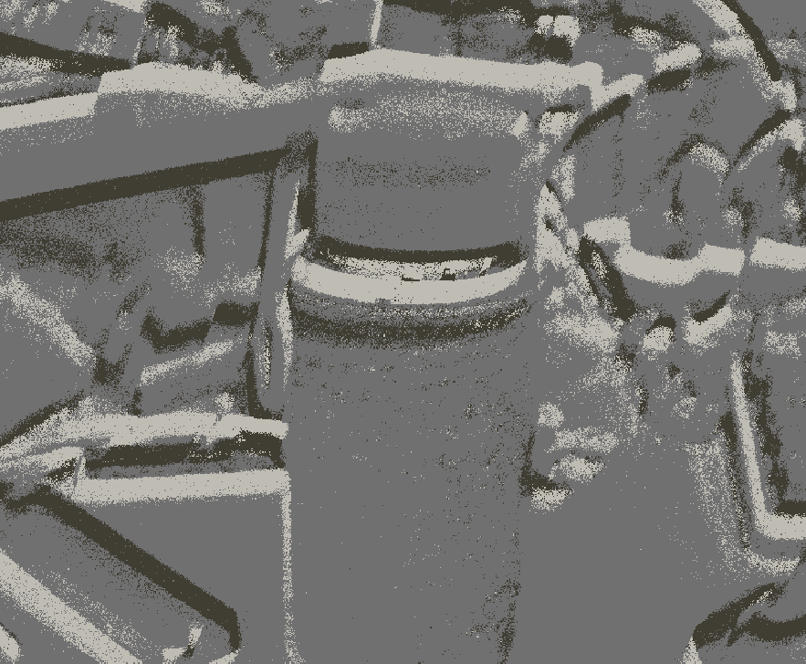
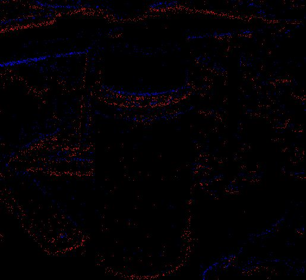

# NWPU_DVS_DVSENSE_ROS

## Overview

This package is a unified **ROS interface for event-based cameras**, integrating both mainstream DVS camera series and the newly supported **Dvsense Lume** event camera.

It is based on the widely adopted [rpg_dvs_ros](https://github.com/uzh-rpg/rpg_dvs_ros) framework, and carefully designed to be **compatible with existing DVS-based algorithms** by maintaining consistent message formats, topic naming, and data structures.

Through this integration, algorithms originally designed for DAVIS or other DVS-series sensors can now seamlessly operate on **Dvsense Lume** data with little to no modification.

This project is based on code from the [Robotics and Perception Group, 2018], originally under the MIT License. Modified and extended by [Zzh], 2025, to support additional hardware and integrations.

See [LICENSE](./LICENSE) for full terms.

#### Reference

[rpg_dvs_ros](https://github.com/uzh-rpg/rpg_dvs_ros) https://github.com/uzh-rpg/rpg_dvs_ros

[dvsense lume](https://dvsense.com/dvslume) https://dvsense.com/dvslume



**Dvsense Insight (Official GUI Program)**    https://sdk.dvsense.com/download/v1.0.3/dvsenseinsight_1.0.3_amd64.deb



**NWPU_DVS_DVSENSE_ROS (this open-source project)** 



---

## Build

The summary of compilation commands is as follows; for more details, please refer to [RPG_DVS_ROS.md](./RPG_DVS_ROS.md)

```
sudo apt-get install ros-kinetic-camera-info-manager
sudo apt-get install ros-kinetic-image-view
sudo apt-get install python-catkin-tools
sudo apt-get install libcaer-dev
```

if `libcaer-dev` false, follow installtion in iniVation documentation.

Then, git clone some dependencies and this repository:

```
cd ~/catkin_ws/src
git clone https://github.com/catkin/catkin_simple.git
git clone https://github.com/uzh-rpg/rpg_dvs_ros.git
```

Finally, compile the whole project with `catkin_make`:

```
cd ~/catkin_ws
catkin_make
```

---

## RUN

if you just run dvsense-lume,

```
roslaunch dvs_renderer dvsense_mono.launch
```

else, you can choose dvs  cameras.

for `DVS128`

```
roslaunch dvs_renderer dvs_mono.launch
```

for `DAVIS`

```
roslaunch dvs_renderer davis_mono.launch
```

for `DVXplorer`

```
roslaunch dvs_renderer dvxplorer_mono.launch
```

---

## Develop

This will be a long-term supported and actively maintained project. In the future, we also plan to develop:

* Calibration
* Multi-Events
* Sensor Fusion
* Denoise
* Ego-Motion
* Target Tracking
* Odometry/SLAM
* Some Challenge Event Dataset

